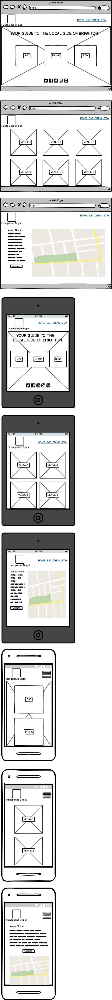

# Milestone Project Two - Handpicked Brighton

---

## Overview

This is a visitors guide to the best place to eat, drink and stay in Brighton. It provides the user with a selection of the best that the city has to offer for their time there. I wanted to highlight a 'locals' view of what's great and what they would tell visitors to do and experience it as a local would.

The illustration on the **HOME** page introduces the quirky and playful vibe that Brighton has. It is relaxed and fun. 

The main sea-green colour used on the website reflect the colour of the paint on the railings and lamp post etc around the city. It's very much the colour of Brighton, so adds a subtle visual signpost.

I created the Handpicked Brighton logo to be reflect the values of the city. The handwritten font is used to show the creative side and the 'handpicked' aspect as if it's a list written by an actual person. The San Serif is bold, stylish and confident. The two contrast and compliment each other. 

---

## UX

The site is fully responsive, so can be viewed on all devices. This makes it fun and easy to plan your trip from a laptop or tablet from home, or from your phone on the move.

The Navigation is always visible allowing the user to click back and forth to each section easliy. The **HOME** page has three large buttons that reflect the Navigation bar to allow an alternative way to get around the site.

Each section (**EAT, DRINK and STAY**) have nine large visual buttons to choose from showing an enticing image of the location, it's name and a simple one word description to give the user help in deciding where to click.

Each button then takes you to a large map showing the location of the venue and a write-up describing it. At the end of the review is a simple button taking the user to the website, and another taking the user back to the main **EAT, DRINK, STAY** menus.

The footer is only visible on the **HOME** page so as not to crowd the simplicity of the other pages. It contains the site's social media.

### User Stories

As a user, I want to quickly and easily find interesting and out of the way places to go in Brighton. 

I want to feel straight away that this site is my kind of style and I can trust it's recommendations.

**User 1: Day tripper:** The user here is only going to be in town for a day, so will want somewhere fun and interesting to have some lunch or dinner, and a few drinks before heading home. They won't want to waste time going places that aren't great. On the site they can discover some interesting places to really make the most of their day.

**User 2: Weekender:** The user here is down for a few days over the weekend. Having never been to Brighton before they are looking for an interesting experience to remember. They don't want to be stuck with the hordes of other day-trippers and toursist, they want to go where the locals go and see the 'real' Brighton.

**User 2: Local resident:** The user here is a resident of the city, that wants to find somewhere new that they just didn't know about.

---

## Features

The following click through pages follow the stylish, simple theme. Picking up the typograhy and colour. 

### Navigation bar

This holds all the links to the main sections of the site: **HOME, EAT, DRINK, STAY**. This allows the user to navigate quickly to the relevant section. the **Handwrittem Brighton** logo also acts as a link to the **HOME** page.

### Home

This is the first page a user comes to, and it has to make a big impact and entice them to want to go further. By having a funky, fun image on the **HOME** page, the user can feel that this is going to be a site with a cool vibe, which reflects the vibe of the city. If they want to tap into the feel of the city and get under its skin, this will be the place to go. The stylish logo and the contempory typography also give a feel of Brighton. The strap line of "YOUR GUIDE TO THE LOCAL SIDE OF BRIGHTON" tells the user just what the purpose of the site is. To make you feel like you're in-the-know.  

The three simple looking buttons, **EAT, DRINK,** and **STAY** immediately intice the user to go further and explore. Their simple message means that it's clear what they will show the user.

### Footer

The footer only appears on the **HOME** page, so not to overcrowd and complicated the following pages. It contains the site's social media.

---

### EAT/DRINK/STAY pages

These are the pages that show when the **EAT, DRINK,** or **STAY** buttons are clicked. They show an arrangement of nine handpicked venues to get food, drink or to stay. The large images give a visual climpse of what the venue looks like. The strong, stylish typography of the name of the venue with a one word classifications under it gives the user more clues about if it's the type of venue they are interested in. There is a simple, clean hover when the mouse glides over each box to show it is highlighted.

---

### Venue information pages

Once a venue is chosen from either **EAT, DRINK,** or **STAY**, the user is taken to a page which displays the information for that venue. It has a large custom map with a marker showing the location, a review of the venue and a link to their website. There is also a button to take you back to the **EAT, DRINK,** or **STAY** page you just came from.

---

## Wireframes

These are my original wireframes for my site.

---

## Features left to implement

There would ideally be many more options to choose from in each section. I chose nine as a nice number for the grid.

On each map page I would have liked to put in more links to other options. 

On the map markers, I would want to have aditional information such as address, contact details, opening times and weblinks.

---

## Technologies used

1. HTML
2. CSS
3. JavaScript
4. jQuery
3. Bootstrap
4. Font Awesome 
5. Google Maps API
6. Google Fonts

---

## Testing
To test both my HTML and my CSS, I ran them through the W3C validation websites. [W3C Markup Validation Service](https://validator.w3.org/), and [W3C CSS Validation Service](https://jigsaw.w3.org/css-validator/).
This allowed me to catch any problems such as rouge punctuation marks or incorrect code. This helped me go back in and change the errors so my code was more efficient and worked properly.

### Navigation bar
1. Test that works at all sizes and toggles down when goes to mobile size by expanding and contracting screen size. 
2. Test all links by hovering over to change colour and by and by making sure they redirect to relevant sections by clicking between them.
3. Test that it is always at the top of the site by scrolling down the pages.

### Home page
1. Test the image fits the whole screen at all sizes by expanding and contracting screen size.
2. Test the main message is visible at all sizes by expanding and contracting screen size.
3. Test **EAT, DRINK, STAY** butons work by hovering over them to change colour and by clicking and seeing if they takes you to the relevant page.

### EAT, DRINK, STAY pages
1. Make sure grid of images flows with the page breaks by expanding and contracting screen size.
2. Test the headings and subheadings are visible on all sizes by expanding and contracting screen size.
3. Test all tiles link to relevant pages when clicked.

### Review pages
1. Make sure grid flows with the page breaks by expanding and contracting screen size.
2. Test the headings, text and maps are visible on all sizes by expanding and contracting screen size.
3. Test all weblinks to make sure they link to the relevant sites.

### Social buttons
1. Test buttons are live and hover works by placing cursor over them to change colour.

### Real life user testing
I tested this out with several family members and friends. 

---

## Deployment
My site is deployed on GitHub. 

1. To create a new Gitpod repository, first click on the **new** button.
2. Give your repository a short and memeorable name, and description so you can identify it later.
3. Tick the 'Initialize this repository with a README' box and then click **Create repository**.
4. Now you can launch **Gitpod** by clicking on the button.
5. Create your **index.html** and get your boilerplate code by typing **!** and **tab**.
6. To preview your project **python3 -m http.server** into the terminal window. This brings up a box with an **Expose** button. You can now choose to open preview or open the browser.
7. To now push your work to GitHub, simply type **git add -A**, then **git commit -m "Intial commit"** (the standard message when starting a repository) and finally **git push**.
8. Go back to GitHub and you will see that your file has now been saved to this remote repository.
9. At regular intervals it is a good idea to commit your files in case something goes wrong.
10. Command git status will show you files that need to be added.
11. Command git add -A will add all those files.
12. Then of course you need a git commit -m "with a message".

I have been pushing my code through to GitHub very regularly as, on occasion, something has gone wrong and I've had to go into my history and retrieve bits of code that I know will work. 

---

## Credits

### Thanks

My mentor **Simen Dehlin** for all the advice and pointers. And for pushing me to go further.

**Chris Quinn (2BN-Chris_alumnus)** for his amazing help on Slack when I was stuck on my coding. Really got me out of a hole.

All the **tutors** that helped me along the way on the **Tutor Support**. 

**RubberDucky** for inspiration and sage advice in the lonely dark hours.

### Images

Home image was sourced from the iStock image library.
[iStock](https://www.istockphoto.com/gb)

All venue images are from the venues' own websites and social media.

### Text

All venue text is from the venues' own websites and social media.

---

## Acknowledgements

### Anna Gilhespy website
I used Anna Gilhespy's Bootstrap tutorial video to help me work out the structure of the content.
[Anna Gilhespy](https://ajgreaves.github.io/bootstrap-grid-demo/)

### Traversy Media YouTube
I watch Traversy Media's YouTube tutorial video, JavaScript Crash Course For Beginners, to help me understand JavaScript.
[JavaScript Crash Course For Beginners](https://www.youtube.com/watch?v=hdI2bqOjy3c)

